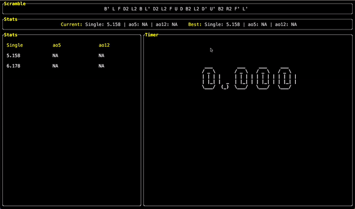

# cube-timer  

A full-fledged Rubik's Cube timer built in Rust.

## Demo



## Install

To install, clone this repo and use cargo package manager to install it as an executable.

```bash
git clone "https://github.com/mcclainclain/cube-timer"
cargo install --path .
```

## NOTICE - PLEASE READ

I wanted the feature to be able to hold and release the space bar for this project (for obvious cuber reasons). Due to this, this cli is **ONLY** supported by terminals implementing the [kitty graphics protocol](https://sw.kovidgoyal.net/kitty/graphics-protocol/). 

Some terminals that include this are:
- [Kitty themselves](https://sw.kovidgoyal.net/kitty/) (recommended)
- [WezTerm](https://github.com/wez/wezterm/issues/986) (recommended)
- [Konsole](https://invent.kde.org/utilities/konsole/-/merge_requests/594)
- [Wayst](https://github.com/91861/wayst)

## TODO

- [ ] Add TableState functionality to select different times in the list
- [ ] Add more settings and color palette selections
- [ ] Update scramble from personal scramble struct to official WCA scramble algorithm
- [ ] Add more WCA cubes (4x4, 5x5, 2x2, etc.)
- [ ] Allow for session switching
- [ ] Any other suggestions!
